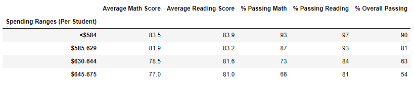
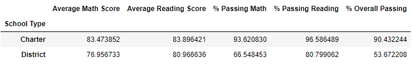

# School_District_Analysis

## Overview of the school district analysis

This project is created to prepare all standardized test data for analysis, and then analyze  it based on student's tests scores, student funding, school types and sizes to showcase trends in school performance. This analysis assists the school board and superintendent in making decisions regarding the school budgets and priorities.

later though it was known that reading and math grades for Thomas High School ninth graders appear to have been altered. So all the math and reading scores of ninth-graders of Thomas High School were replaced with NaNs while keeping the rest of the data intact.

Comparing the old data analysis to new one with replaced data following questions are addressed:

- How is the district summary affected?
- How is the school summary affected?
- How does replacing the ninth graders’ math and reading scores affect Thomas High School’s performance relative to the other schools?
- How does replacing the ninth-grade scores affect the following:
  - Math and reading scores by grade
  - Scores by school spending
  - Scores by school size
  - Scores by school type

## Results

- How is the district summary affected?

  The district summary used to have following numbers:

  

  And here is the updated district summary:

  

  We can see that 

  - the average math score around the district dropped by 0.1 grade

  - the average reading score was not affected 

  - percent of students who passed math reduced by 0.2%

  - percent of students who passed reading reduced by 0.3%

  - percent of students who passed both math and reading reduced by 0.1%

    

- How is the school summary affected?

  The school summary for Thomas High School used to have following numbers:

  

  And here is the new school summary for Thomas High School:

  

  We can see that:

  - the average math score  **dropped** by 0.06712 grade

  - the average reading score **raised** by 0.047152 grade

  - percent of students who passed math **reduced** by 0.086481%

  - percent of students who passed reading **reduced** by 0.29013%

  - percent of students who passed both math and reading **reduced** by 0.317688%

    

- How does replacing the ninth graders’ math and reading scores affect Thomas High School’s performance relative to the other schools?

  Thomas High School used to be on the second place in a list of top-performing schools:

  

  And after replacing the ninth graders’ math and reading scores it is still there:

  

  So relative to other schools Thomas High School’s performance didn't change.

  

- How does replacing the ninth-grade scores affect the following:

  - Math and reading scores by grade

    The old math scores by grade were:

    

    After replacing the ninth graders’ math scores we got following table:

    

    The initial reading scores by grade table was:

    

    After replacing the ninth graders’ reading scores we got:

    

    So replacing the ninth-grade scores of Thomas High School affects only "Thomas High School" "9th"-grade cells by replacing those values with "nan".

  - Scores by school spending

    Before changing Thomas High School ninth-graders grades the scores by school spending were:

    

    

    or after formatting:

    

    After those changes we got:

    

    

    and after formatting:

    
  
    Comparing these two tables we can see minor changes in $630-644 bin that are not seen after rounding off so we can conclude that replacing the ninth-grade Thomas High School scores did not significantly affect scores by school spending. 
  
  - Scores by school size
  
    The initial table of school performance based on the school size is:
  
    
  
    Which after formatting looks like:
  
    
  
    After replacing the ninth graders’ math and reading scores we got:
  
    
  
    Formatted:
  
    
  
    There are slightly different numbers in precise numbers for medium size schools (1000 to 2000 students) but after rounding off there are no any changes visible so we can conclude that replacing the ninth-grade Thomas High School scores did not significantly affect scores by school size. 
  
  - Scores by school type
  
    The initial performance of the schools based on their type is:
  
    
  
    Which formatted is:
  
    
  
    The updated one is:
  
    
  
    Formatted:
  
    
  
    There are minor changes in charter schools' performance that are not visible after round off. In general, replacing the ninth-grade Thomas High School scores did not significantly affect scores by school type.
  
    
  
    ## Summary
  
    After reading and math scores for the ninth grade at Thomas High School have been replaced with NaNs the overall performance of the school district **decreased**: 
  
    - by 0.1 grade the average math score, 
  
    - by 0.2% percent of students who passed math, 
  
    - by 0.3% percent of students who passed reading 
  
    - by 0.1% percent of students who passed both math and reading. 
  
      The school summary for Thomas High School was also affected:
  
    - the average math score  **dropped** by 0.06712 grade
  
    - the average reading score **raised** by 0.047152 grade
  
    - percent of students who passed math **reduced** by 0.086481%
  
    - percent of students who passed reading **reduced** by 0.29013%
    
    - percent of students who passed both math and reading **reduced** by 0.317688%
    
      Math and reading scores by grade for all schools and grades did not change except Thomas High School ninth-grade students' scores - they were replaced with NaNs.
    
    At the same time Thomas High School’s performance relative to the other schools, scores by school spending, scores by school size and scores by school type did not significantly change.
    
    

​		

